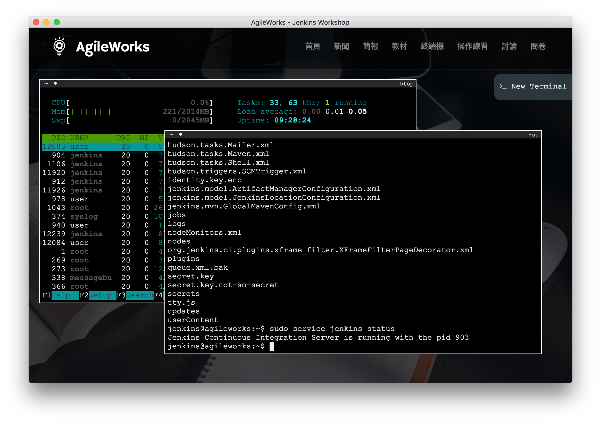
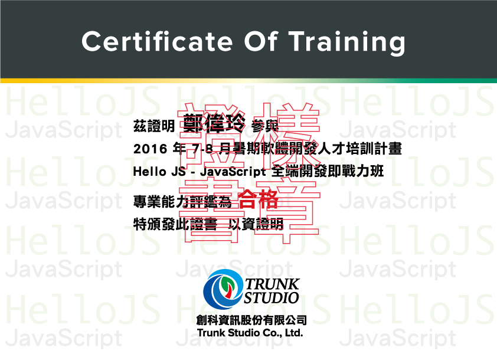

# Hello JS - JavaScript 全端開發即戰力班

暑期 48 小時特別企劃

## 課程特色

1. 採用 Workshop 現場實作方式進行，由多位業界技術專家共同指導！

1. 搭配 Docker、AWS、Atom、⋯等業界常用的平台及工具輔助，讓學習經驗無縫銜接未來職場需求。

1. 強調以 Command Line 操作為主，不依賴特定圖形化開發工具，培養真正的實力與即戰力，教學過程以 Ubuntu Linux 作業系統為主，經驗可適用於 Linux 與 Mac OS X。

1. 獲得內容持續更新的講義電子書，並使用 Slack 提供線上課程內容討論與課後諮詢問答服務。

1. 採用獨家開發的 AgileWorks VM 教學系統，有效提升學習效率。

1. 所有學員結訓通過評核即頒予結訓證書乙張。

1. 分組進行專題實作，由講師團隊輔導，並於八月底培訓完成後提交實作成果，公開邀請業界專家評選，優秀作品頒予獎金鼓勵。

1. 協助學員建立更棒的個人簡歷，由專業講師指導簡歷撰寫技巧、面試秘訣與提供職涯規劃建議。

1. 開創職涯的起點，媒合優秀學員投遞簡歷至本專案合作企業面試提高就業機會。

## 課程大綱

依據 2016 年最佳學習路線指引，規劃出進入職場必備的軟體開發技能。

* Git 版本控制【基礎】

* JavaScript 程式語言【基礎】

* Node.js 後端程式實作【基礎】

* React 前端開發實戰【進階】

* React Native 跨平台 APP 開發實戰【進階】

* Jenkins 持續整合與自動化測試【基礎】

我們的目標是讓每位學員在短短 2 個月時間內，汲取 2 年以上的實務經驗！

## 結訓證書

完成課程中所有的實作，頒予印刷精美的證書乙張，加上豐富滿點的 GitHub Commit Logs，讓你的 Programmer 職涯贏在起跑點！

