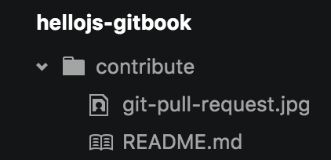

# contribute


## 步驟

1. fork <https://github.com/agileworks-tw/hellojs-gitbook>
2. 編寫新章節及內容
3. 發 pull request
4. review
4. accept change
5. merge into Origin Repo


## 編寫注意事項

1. 每一章節都為一個 folder，如 contribute folder，每一個章節都會有一個 `README.md` 撰寫章節內容

  

2. 圖片請分章節放，一律放在每一章節的資料夾下，放置圖片語法 ``


## 章節內容範本（工作坊類型）

若為敘述型章節則不在此限

```
# 章節名稱

## 難度：

## 目標：

## 專案網址：

## 練習步驟：

## 參考資料：
```

## 範例

```
# Hello! Jenkins!

## 難度：

簡易

## 目標：

認識 Jenkins Job 基礎操作。

## 專案：

<https://github.com/agileworks-tw/java-hello-world>

## 練習：

1. 新增作業（Jenkins Job）名稱：`HelloWorld`
2. 使用 Shell 指令檢查 JDK 版本

   java -version
   javac -version

3. 將會看到下列資訊輸出

  java 1.7
  javac 1.7

```
