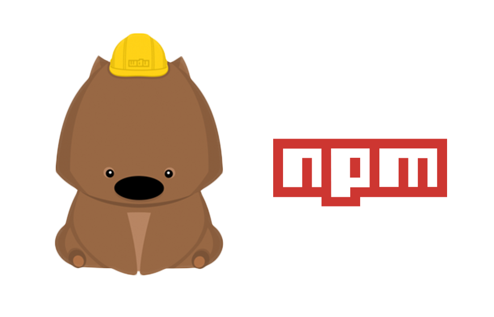

# 目錄
- 概述
- npm init
- npm set
- npm info
- npm search
- npm list
- npm install
- 安裝不同版本
- 避免使用系統權限
- npm update，npm uninstall
- npm run

## 概述

npm有兩層含義。一層含義是Node的開放式套件登記和管理系統，網址為npmjs.org。另一層含義是Node默認的套件管理器，是一個命令行下的軟件，用來安裝和管理Node套件。


npm不需要單獨安裝。在安裝Node的時候，會連帶一起安裝npm。但是，Node附帶的npm可能不是最新版本，最好用下面的命令，更新到最新版本。
```
$ npm install npm@latest -g
```
上面的命令中，@latest表示最新​​版本，-g表示全域安裝。所以，命令的主幹是npm install npm，也就是使用npm安裝自己。之所以可以這樣，是因為npm本身與Node的其他套件沒有區別。

然後，運行下面的命令，查看各種信息。
```
# 查看 npm 命令列表
$ npm help

# 查看各個命令的簡單用法
$ npm -l

# 查看 npm 的版本
$ npm -v

# 查看 npm 的配置
$ npm config list -l
```
## npm init
npm init用來初始化生成一個新的package.json文件。它會向用戶提問一系列問題，如果你覺得不用修改默認配置，一路回車就可以了。

如果使用了-f（代表force）、-y（代表yes），則跳過提問階段，直接生成一個新的package.json文件。
```
$ npm init -y
```
## npm set
npm set用來設置環境變量。
```
$ npm set init-author-name 'Your name'
$ npm set init-author-email 'Your email'
$ npm set init-author-url 'http://yourdomain.com'
$ npm set init-license 'MIT'
```
上面命令等於為npm init設置了默認值，以後執行npm init的時候，package.json的作者姓名、郵件、主頁、許可證字段就會自動寫入預設的值。這些信息會存放在用戶主目錄的 ~/.npmrc文件，使得用戶不用每個專案都輸入。如果某個專案有不同的設置，可以針對該專案運行npm config。
```
$ npm set save-exact true
```
上面命令設置加入套件時，package.json將記錄套件的確切版本，而不是一個可選的版本範圍。

## npm info
npm info命令可以查看每個套件的具體信息。比如，查看underscore套件的信息。
```
$ npm info underscore
{ name: 'underscore',
  description: 'JavaScript\'s functional programming helper library.',
  'dist-tags': { latest: '1.5.2', stable: '1.5.2' },
  repository:
   { type: 'git',
     url: 'git://github.com/jashkenas/underscore.git' },
  homepage: 'http://underscorejs.org',
  main: 'underscore.js',
  version: '1.5.2',
  devDependencies: { phantomjs: '1.9.0-1' },
  licenses:
   { type: 'MIT',
     url: 'https://raw.github.com/jashkenas/underscore/master/LICENSE' },
  files:
   [ 'underscore.js',
     'underscore-min.js',
     'LICENSE' ],
  readmeFilename: 'README.md'}
```
上面命令返回一個JavaScript對象，包含了underscore套件的詳細信息。這個對象的每個成員，都可以直接從info命令查詢。
```
$ npm info underscore description
JavaScript's functional programming helper library.

$ npm info underscore homepage
http://underscorejs.org

$ npm info underscore version
1.5.2
```
## npm search
npm search命令用於搜索npm倉庫，它後面可以跟字符串，也可以跟正則表達式。
```
$ npm search <搜索詞>
下面是一個例子。

$ npm search node-gyp
// NAME DESCRIPTION
// autogypi Autogypi handles dependencies for node-gyp projects.
// grunt-node-gyp Run node-gyp commands from Grunt.
// gyp-io Temporary solution to let node-gyp run `rebuild` under…
// ...
```
## npm list
npm list命令以樹型結構列出當前專案安裝的所有套件，以及它們依賴的套件。
```
$ npm list
加上global參數，會列出全域安裝的套件。

$ npm list -global
npm list命令也可以列出單個套件。

$ npm list underscore
```
## npm install
基本用法
Node套件採用npm install命令安裝。

每個套件可以“全域安裝”，也可以“本地安裝”。 “全域安裝”指的是將一個套件安裝到系統目錄中，各個專案都可以使用。一般來說，全域安裝只適用於工具套件，比如npm和grunt。 “本地安裝”指的是將一個套件下載到當前專案的node_modules子目錄，然後只有在專案目錄之中，才能使用這個套件。
```
# 本地安裝
$ npm install <package name>

# 全域安裝
$ sudo npm install -global <package name>
$ sudo npm install -g <package name>
npm install也支持直接輸入Github代碼庫地址。

$ npm install git://github.com/package/path.git
$ npm install git://github.com/package/path.git#0.1.0
```
安裝之前，npm install會先檢查，node_modules目錄之中是否已經存在指定套件。如果存在，就不再重新安裝了，即使遠端倉庫已經有了一個新版本，也是如此。

如果你希望，一個套件不管是否安裝過，npm 都要強制重新安裝，可以使用-f或--force參數。
```
$ npm install <packageName> --force
```
如果你希望，所有套件都要強制重新安裝，那就刪除node_modules目錄，重新執行npm install。
```
$ rm -rf node_modules
$ npm install
```
## 安裝不同版本
install命令總是安裝套件的最新版本，如果要安裝套件的特定版本，可以在套件名後面加上@和版本號。
```
$ npm install sax@latest
$ npm install sax@0.1.1
$ npm install sax@">=0.1.0 <0.2.0"
```
如果使用--save-exact參數，會在package.json文件指定安裝套件的確切版本。
```
$ npm install readable-stream --save --save-exact
```
install命令可以使用​​不同參數，指定所安裝的套件屬於哪一種性質的依賴關係，即出現在packages.json文件的哪一項中。
- –save：套件名將被添加到dependencies，可以簡化為參數-S。
- –save-dev: 套件名將被添加到devDependencies，可以簡化為參數-D。

```
$ npm install sax --save
$ npm install node-tap --save-dev
# 或者
$ npm install sax -S
$ npm install node-tap -D
```
如果要安裝beta版本的套件，需要使用下面的命令。

# 安裝最新的beta版
```
$ npm install <module-name>@beta (latest beta)
```

# 安裝指定的beta版
```
$ npm install <module-name>@1.3.1-beta.3
```
npm install默認會安裝dependencies字段和devDependencies字段中的所有套件，如果使用production參數，可以只安裝dependencies字段的套件。
```
$ npm install --production
# 或者
$ NODE_ENV=production npm install
```
一旦安裝了某個套件，就可以在代碼中用require命令使用這個套件。
```
var backbone = require('backbone')
console.log(backbone.VERSION)
```
## 避免系統權限
默認情況下，Npm全域套件都安裝在系統目錄（比如/usr/local/lib/），普通用戶沒有寫入權限，需要用到sudo命令。這不是很方便，我們可以在沒有root權限的情況下，安裝全域套件。

首先，在主目錄下新建配置文件.npmrc，然後在該文件中將prefix變量定義到主目錄下面。
```
prefix = /home/yourUsername/npm
```
然後在主目錄下新建npm子目錄。
```
$ mkdir ~/npm
```
此後，全域安裝的套件都會安裝在這個子目錄中，npm也會到~/npm/bin目錄去尋找命令。

最後，將這個路徑在.bash_profile文件（或.bashrc文件）中加入PATH變量。
```
export PATH=~/npm/bin:$PATH
```
## npm update，npm uninstall
npm update命令可以更新本地安裝的套件。
```
# 升級當前專案的指定套件
$ npm update [package name]

# 升級全域安裝的套件
$ npm update -global [package name]
```
它會先到遠端倉庫查詢最新版本，然後查詢本地版本。如果本地版本不存在，或者遠端版本較新，就會安裝。

使用-S或--save參數，可以在安裝的時候更新package.json裡面套件的版本號。
```
// 更新之前的package.json
dependencies: {
  dep1: "^1.1.1"
}

// 更新之後的package.json
dependencies: {
  dep1: "^1.2.2"
}
```
注意，從npm v2.6.1 開始，npm update只更新頂層套件，而不更新依賴的依賴，以前版本是遞歸更新的。如果想取到老版本的效果，要使用下面的命令。
```
$ npm --depth 9999 update
```
npm uninstall命令，卸載已安裝的套件。
```
$ npm uninstall [package name]

# 卸載全域套件
$ npm uninstall [package name] -global
```
## npm run
npm不僅可以用於套件管理，還可以用於執行腳本。 package.json文件有一個scripts字段，可以用於指定腳本命令，供npm直接使用。
```
{
  "name": "myproject",
  "devDependencies": {
    "jshint": "latest",
    "browserify": "latest",
    "mocha": "latest"
  },
  "scripts": {
    "lint": "jshint **.js",
    "test": "mocha test/"
  }
}
```
上面代碼中，scripts字段指定了兩項命令lint和test。命令行輸入`npm run-script lint`或者`npm run lint`，就會執行`jshint **.js`，輸入`npm run-script test`或者`npm run test`，就會執行`mocha test/`。 `npm run`是`npm run-script`的縮寫，一般都使用前者，但是後者可以更好地反應這個命令的本質。

`npm run`命令會自動在環境變量$PATH添加`node_modules/.bin`目錄，所以scripts字段裡面使用命令時不用加上路徑，這就避免了全域安裝NPM套件。

npm內置了兩個命令簡寫，npm test等同於執行npm run test，npm start等同於執行npm run start。

npm run會創建一個Shell，執行指定的命令，並臨時將node_modules/.bin加入PATH變量，這意味著本地套件可以直接運行。

舉例來說，你執行ESLint的安裝命令。
```
$ npm i eslint --save-dev
```
運行上面的命令以後，會產生兩個結果。首先，ESLint被安裝到當前目錄的node_modules子目錄；其次，node_modules/.bin目錄會生成一個符號鏈接node_modules/.bin/eslint，指向ESLint套件的可執行腳本。

然後，你就可以在package.json的script屬性裡面，不帶路徑的引用eslint這個腳本。
```
{
  "name": "Test Project",
  "devDependencies": {
    "eslint": "^1.10.3"
  },
  "scripts": {
    "lint": "eslint ."
  }
}
```
等到運行npm run lint的時候，它會自動執行./node_modules/.bin/eslint .。

如果直接運行npm run不給出任何參數，就會列出scripts屬性下所有命令。
```
$ npm run
Available scripts in the user-service package:
  lint
     jshint **.js
  test
    mocha test/
```
下面是另一個package.json文件的例子。
```
"scripts": {
  "watch": "watchify client/main.js -o public/app.js -v",
  "build": "browserify client/main.js -o public/app.js",
  "start": "npm run watch & nodemon server.js",
  "test": "node test/all.js"
},
```
上面代碼在scripts項，定義了四個別名，每個別名都有對應的腳本命令。
```
$ npm run watch
$ npm run build
$ npm run start
$ npm run test
```
其中，start和test屬於特殊命令，可以省略run。
```
$ npm start
$ npm test
```
如果希望一個操作的輸出，是另一個操作的輸入，可以藉用Linux系統的管道命令，將兩個操作連在一起。
```
"build-js": "browserify browser/main.js | uglifyjs -mc > static/bundle.js"
```
但是，更方便的寫法是引用其他npm run命令。
```
"build": "npm run build-js && npm run build-css"
```
上面的寫法是先運行npm run build-js，然後再運行npm run build-css，兩個命令中間用&&連接。如果希望兩個命令同時平行執行，它們中間可以用&連接。
