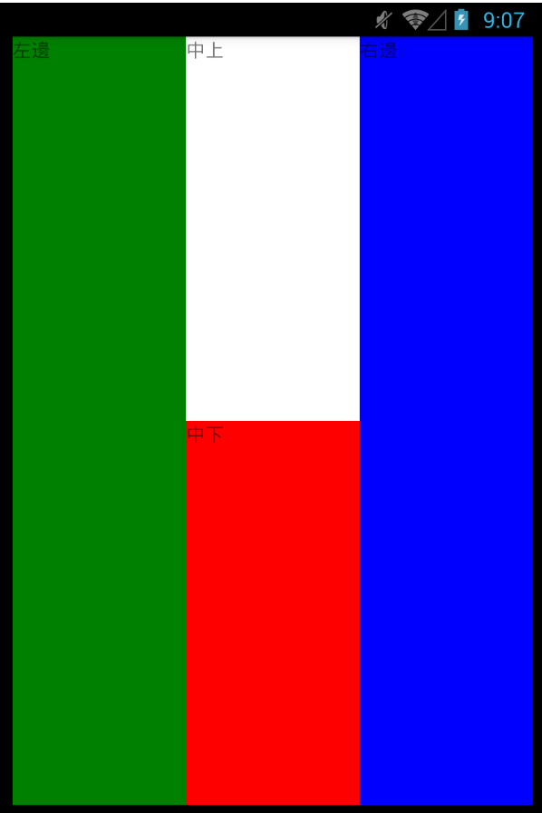

I##StyleSheet.create

駝峰式的 CSS 屬性名稱

```
const styles = StyleSheet.create({
  container: {
    flex: 1,
    justifyContent: 'center',
    alignItems: 'center',
    backgroundColor: '#F5FCFF',
  },
});

```
類似CSS的樣式程式碼撰寫方式

##使用樣式

* 單樣式使用方式

	`<View style={styles.container} />`

* 使用多個樣式

	`<View style={[styles.container, style.style2]} />`

	與 Object.assign 相同，若有衝突，右邊優先

* 以條件選擇樣式

	`<View style={[styles.base,this.state.active && styles.active]} />`

	預設執行前項`styles.base`樣式，當後面`this.state.active`狀態改變為true或成立時執行後項`styles.active`的樣式


##樣式變換

目標:按按鈕變換按鈕顏色

* 建立樣式

* 先在下方const styles內新增樣式blue和green,如下

```
const styles = StyleSheet.create({
  blue:{
    backgroundColor: 'blue'
  },
  green:{
    backgroundColor: 'green'
  }
});
```

* 建立按鈕

* 事件需匯入TouchableOpacity來產生按鈕,如下

```
import {
  TouchableOpacity
} from 'react-native';
```

* 按鈕功能判斷

* 點擊改變true或false來判斷是否點擊來做顏色的變換
在constructor(props)中設定active初值,如下

```
constructor(props) {
    super(props)
    this.state = {
     active: false,
    }
   }
```

* 設定onPress功能的狀態變化   

```
   onPress = () => {
   this.setState({active: !this.state.active});
   }
```   

 * 在render中顯示button的按鈕

```
 <TouchableOpacity onPress={this.onPress}>
        <Text>
          button
        </Text>
      </TouchableOpacity>
```

* 在onPress={this.onPress}加入樣式的變化判斷

```
style={[styles.blue, this.state.active && styles.green]}
```

程式碼整段會變成如下

```
    <TouchableOpacity onPress={this.onPress} style={[styles.blue, this.state.active && styles.green]}>
        <Text>
          button
        </Text>
    </TouchableOpacity>
```

說明```style={[styles.blue, this.state.active && styles.green]}```

    1. 畫面預設會先執行styles.blue

    2. 按下按鈕後this.state.active成立變成true就會執行styles.green

    3. 再按一下this.state.active變成false就會回到預設styles.blue

所有程式碼

要複製直接套用記得把裡面有`app2`的改成你的檔名

```
import React, { Component } from 'react';
import {
  AppRegistry,
  StyleSheet,
  Text,
  View,
  TouchableOpacity
} from 'react-native';

class app2 extends Component {
   constructor(props) {
    super(props)
    this.state = {
     active: false,
    }
   }
   onPress = () => {
   this.setState({active: !this.state.active});
   }

  render() {
    return (
      <View style={styles.container}>
      <TouchableOpacity onPress={this.onPress} style={[styles.blue, this.state.active && styles.green]}>
        <Text>
          button
        </Text>
      </TouchableOpacity>
        <Text style={styles.instructions}>
          style 樣式練習{'\n'}
          按按鈕變換按鈕顏色
        </Text>
      </View>
    );
  }
}

const styles = StyleSheet.create({
  container: {
    flex: 1,
    justifyContent: 'center',
    alignItems: 'center',
    backgroundColor: '#F5FCFF',
  },
  instructions: {
    textAlign: 'center',
    color: '#333333',
    marginBottom: 5,
  },
  blue:{
    backgroundColor: 'blue'
  },
  green:{
    backgroundColor: 'green'
  }
});

AppRegistry.registerComponent('app2', () => app2);
```

##使用Flexbox布局

目標：畫面佈局與分割

* 排版方向，預設是 column
flexDirection 方向排版比例

將以下加入到render中
畫面中會變成垂直2:1的顏色條(亮藍色:亮綠色)

```
<View style={styles.container}>
    <View style={{
        flex: 2,
        backgroundColor: 'lightblue'
    }}>
        <Text>View1</Text>
    </View>
    <View style={{
        flex: 1,
        backgroundColor: 'lightgreen'
    }} >
        <Text>View2</Text>
    </View>
</View>
```

###justifyContent & alignItems

* justifyContent

	flexDirection方向的子元素排版

	能用的值:flex-start, center, flex-end, space-around, space-between


* alignItems

	垂直 flexDirection 方向的子元素排版

	能用的值:flex-start, center, flex-end, stretch

如果只要設定自己元素的排版用alignSelf

例如:alignSelf:flex-start這是設定靠上對齊畫面中的分割

以下範例圖示



以下所有程式碼

```
import React, { Component } from 'react';
import {
  AppRegistry,
  StyleSheet,
  Text,
  View
} from 'react-native';

class app3 extends Component {
  render() {
    return (
    <View style={styles.container}>

        <View style={{flex: 1,backgroundColor: 'green'}}>
        {/*左邊(由左而右)*/}
          <Text>左邊</Text>
        </View>
        <View style={{flex: 1,backgroundColor: 'gray'}} >
        {/*中間這一塊(由左而右)*/}
          <View style={{flex: 1,backgroundColor: 'white'  }} >
          {/*中間裡面包含上面一塊(由上而下)*/}
              <Text>中上</Text>
          </View>
          <View style={{flex: 1,backgroundColor: 'red'}}>
          {/*中間裡面包含下面一塊(由上而下)*/}
              <Text>中下</Text>
          </View>
        </View>

        <View style={{flex: 1,backgroundColor: 'blue'}} >
        {/*右邊(由左而右)*/}
          <Text>右邊</Text>
        </View>
      </View>
    );
  }
}

const styles = StyleSheet.create({
  container: {
    flex: 1,
    flexDirection:'row',    //這裡設定由左而右排,若未設定預設是從上而下
    justifyContent: 'center',
    alignItems: 'stretch',
    backgroundColor: '#F5FCFF',
  },
  welcome: {
    fontSize: 20,
    textAlign: 'center',
    margin: 10,
  },
  instructions: {
    textAlign: 'center',
    color: '#333333',
    marginBottom: 5,
  },
});

AppRegistry.registerComponent('app3', () => app3);
```
