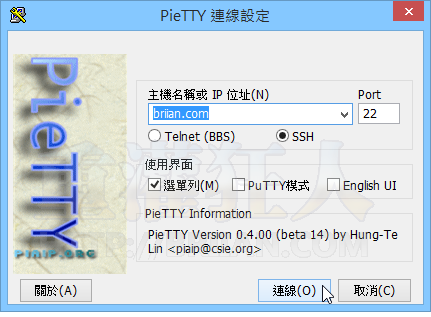
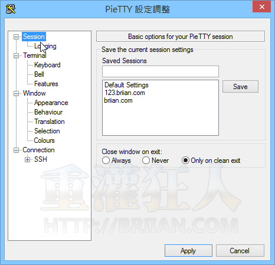

# PieTTY

PieTTY 是基於國外相當知名的 PuTTY 連線工具發展而來，除了改善了部份操作界面讓它更簡單好用之外，最重要的是改善了非英語系操作環境的多語支援，尤其針對 CJK（中文/日文/韓文）的顯示與錯誤…等問題做了改善。

PieTTY 下載回來之後也不用安裝或做任何設定，直接點兩下就可以開始執行、使用，預設情況下只要輸入主機名稱或 IP 位址，就能馬上連線、操作。

## 下載網址

<http://123.briian.com/forum.php?mod=viewthread&tid=3229>

## 使用方式

第1步  將 PieTTY 下載回來、點兩下就會開啟下面這個視窗，依照你的需求選用 Telnet 或 SSH 等連線方式，只要在方框中輸入 IP 或網址再按「連線」即可開始使用。

第2步  連線登入後的操作介面。

第3步  設定介面跟 PuTTY 差不多。

#### 參考資料

<https://briian.com/21989/pietty.html>
