# TortoiseGit

## install

* 64 bit: https://download.tortoisegit.org/tgit/2.1.0.0/TortoiseGit-2.1.0.0-64bit.msi
* 32 bit: https://download.tortoisegit.org/tgit/2.1.0.0/TortoiseGit-2.1.0.0-32bit.msi

## 中文化

* 32 bit: https://download.tortoisegit.org/tgit/2.1.0.0/TortoiseGit-LanguagePack-2.1.0.0-32bit-zh_TW.msi
* 64 bit: https://download.tortoisegit.org/tgit/2.1.0.0/TortoiseGit-LanguagePack-2.1.0.0-64bit-zh_TW.msi

## 基本設置

### 中文化

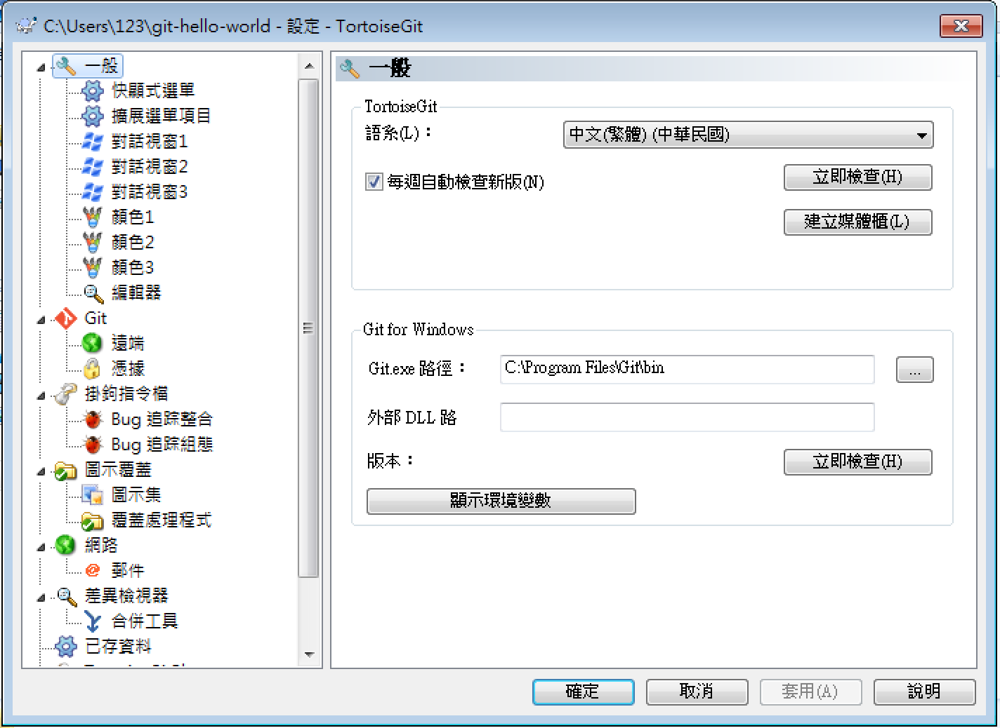

### 記住帳號密碼

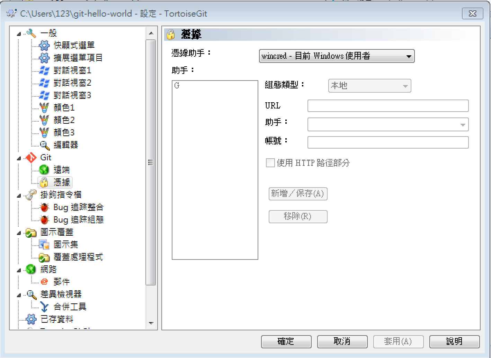

## 基本流程

### add

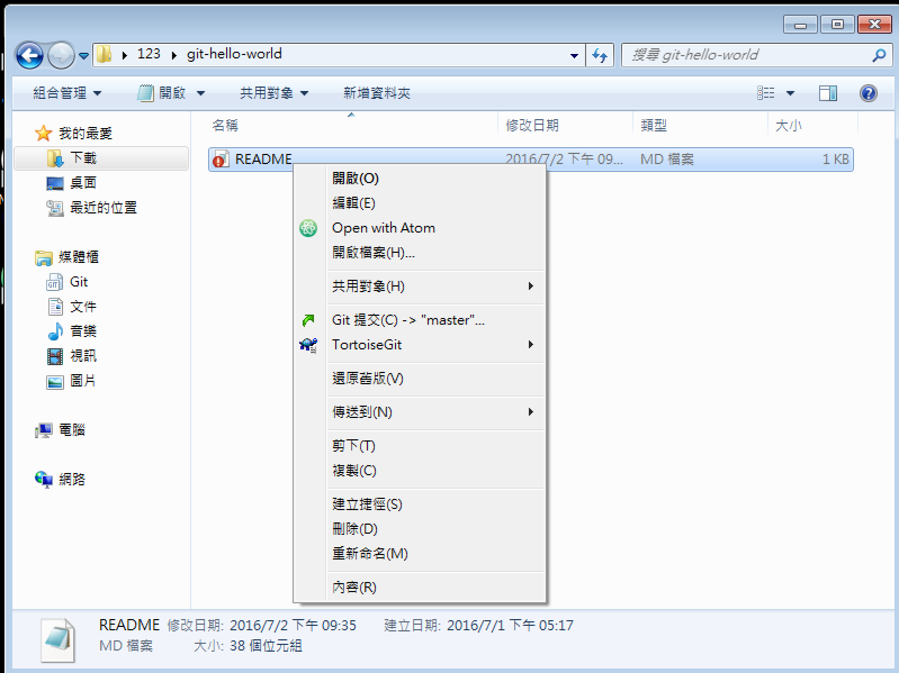

### commit

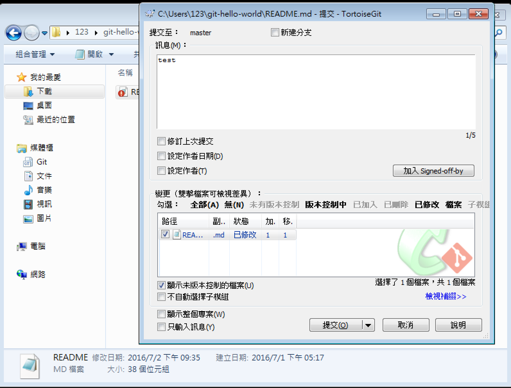

### push

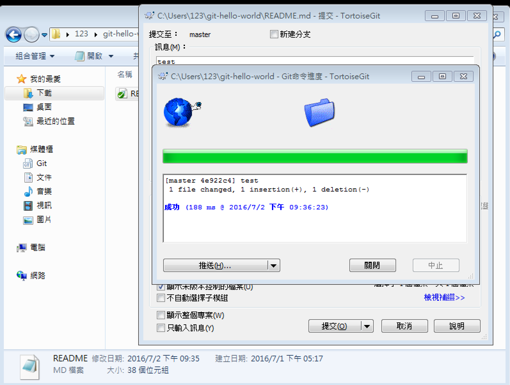

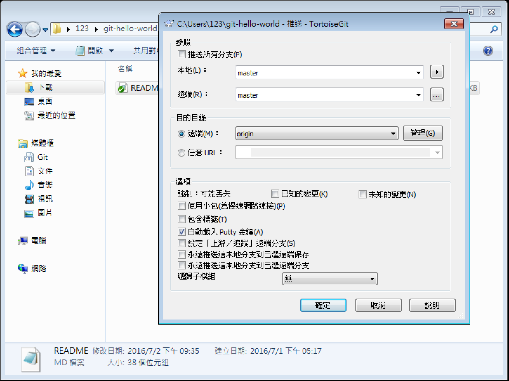

## sync

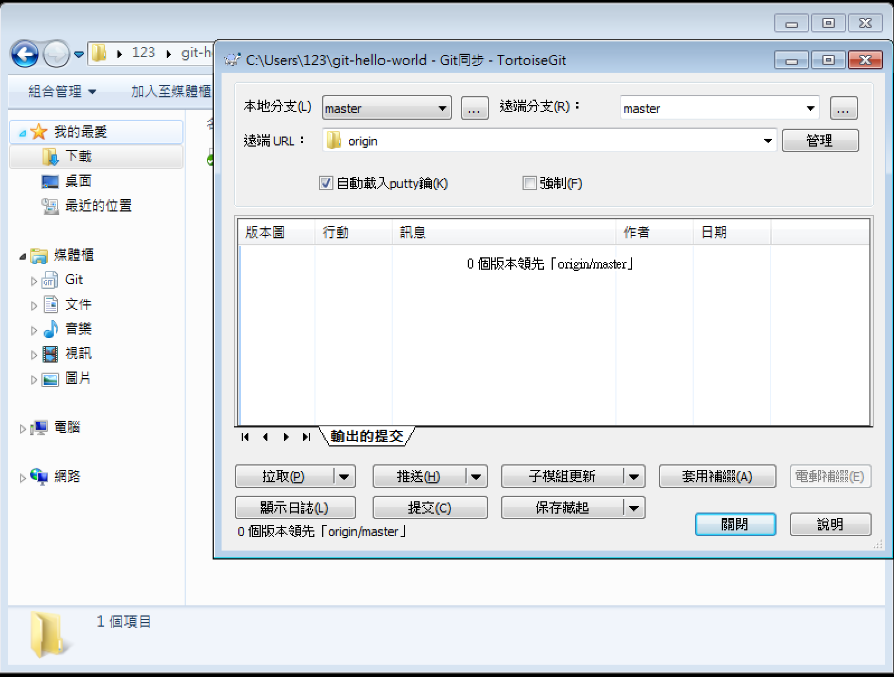

## 分支操作

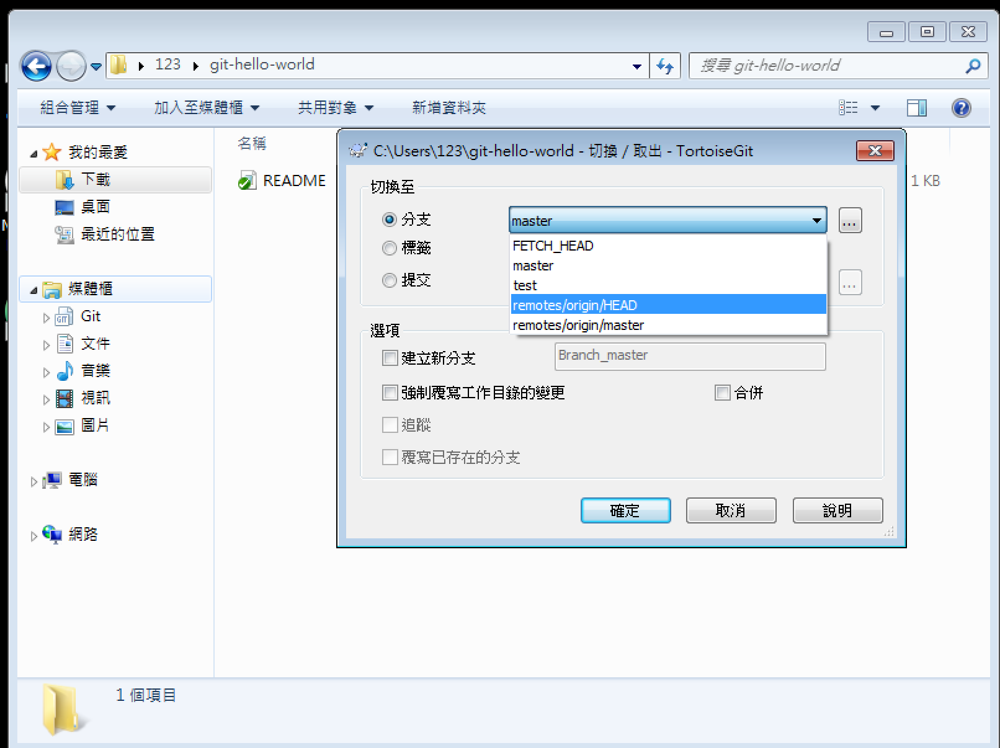

## 編修衝突

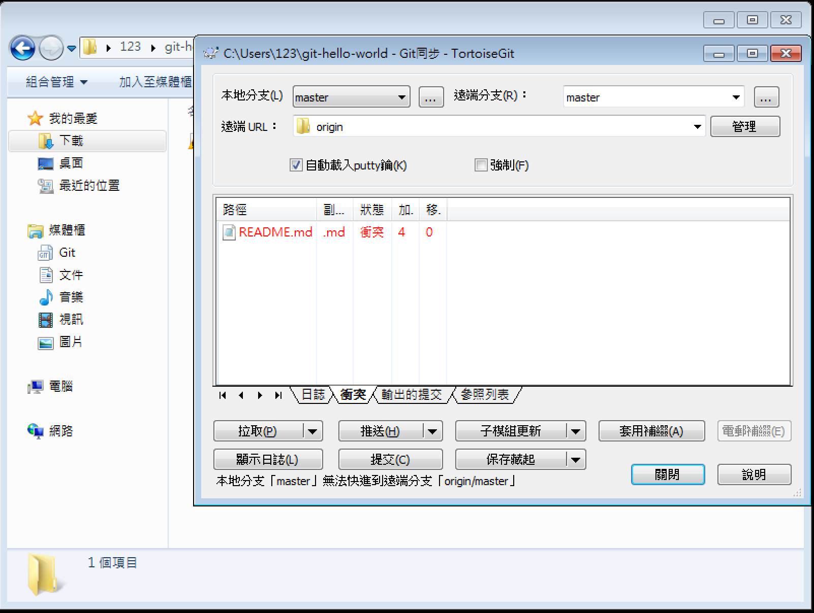

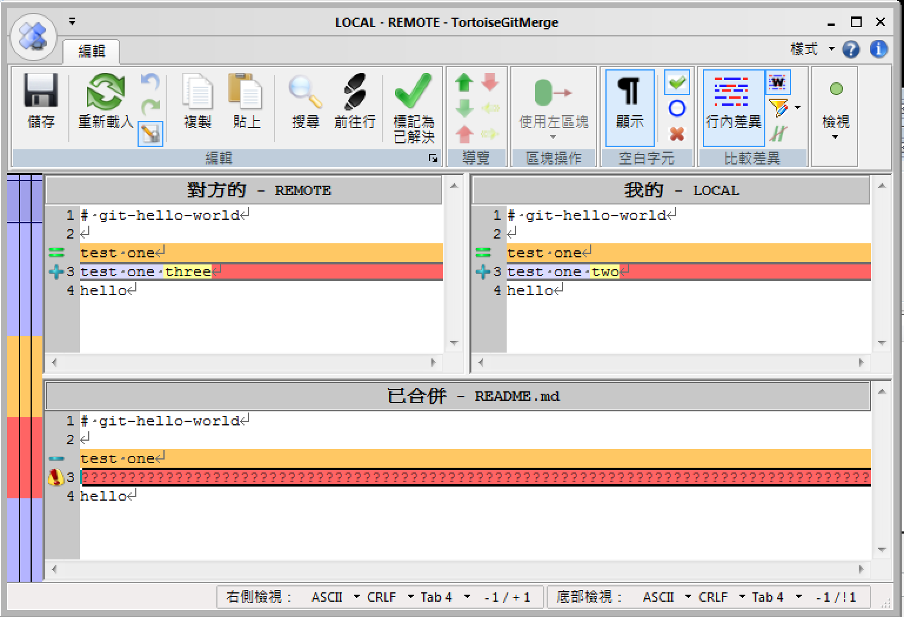

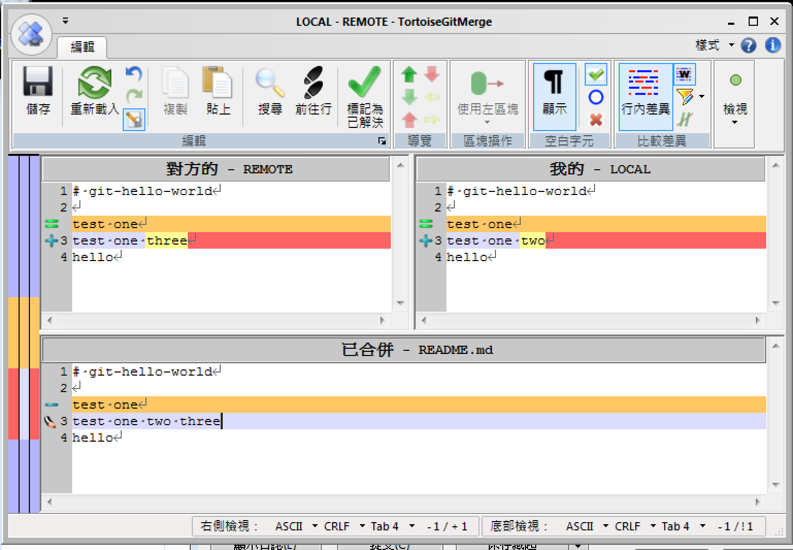

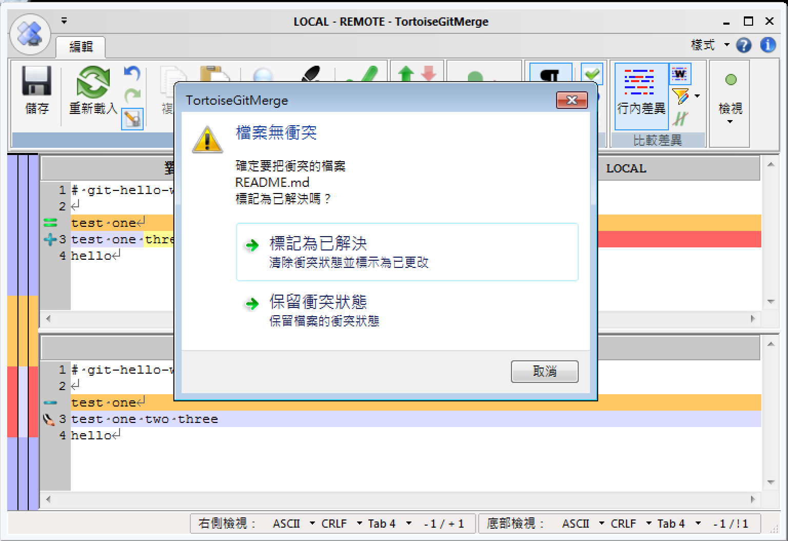
