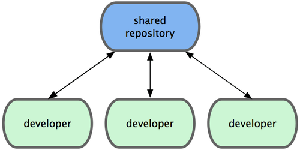
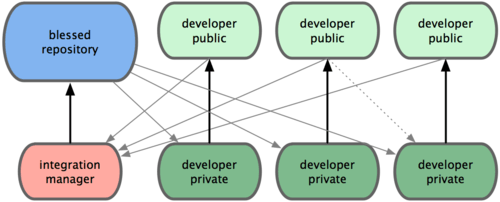
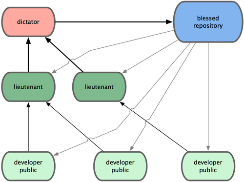
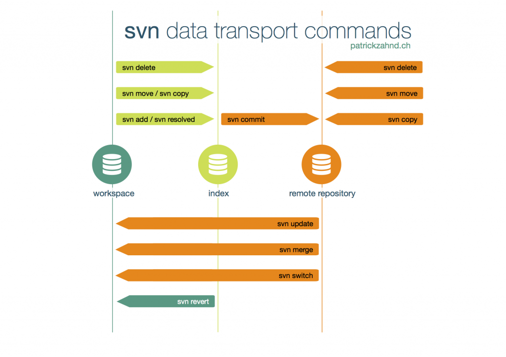

# Git 入門

Linus Torvalds（Linux Kernel 與 Git 作者）稱 Git 是「來自地獄的資訊管理者」。

[Initial revision of "git", the information manager from hell](https://github.com/git/git/commit/e83c5163316f89bfbde7d9ab23ca2e25604af290)

> I'm an egotistical bastard, and I name all my projects after myself. First Linux, now git.	--- Linus Torvalds

## 分散式工作流程

集中式工作流

集成管理員工作流

司令官與副官工作流

## 提供 Git 服務的網站

* GitHub
* Bitbucket
* GitLab

## 練習工具

* [Code School - Try Git](https://try.github.io/)

## 學習資源

* [連猴子都能懂的 Git 入門指南](https://backlogtool.com/git-guide/tw/)
* [25個線上實際操作學習 Git、Github](https://blog.longwin.com.tw/2013/01/git-github-code-school-2013/)

Git版本控制系統的操作可以藉由指令或是GUI的操作達到我們想要的目的。

## Git vs Svn

## 常用 Git 指令介紹

* `git init`

  建立新的本地端 Repository。

* `git clone [Repository URL]`

  複製遠端的 Repository 檔案到本地端。

* `git status`

   檢查本地端檔案異動狀態。

* `git add [檔案或資料夾]`

   將指定的檔案（或資料夾）加入版本控制。用 `git add .` 可加入全部。

* `git commit`

   提交（commit）目前的異動。

* `git commit -m "提交說明內容"`

   提交（commit）目前的異動並透過 `-m` 參數設定摘要說明文字。

* `git stash`

   獲取目前工作目錄的 dirty state，並保存到一個未完成變更的 stack，以方便隨時回復至當初的 state。

* `git log`

   查看先前的 commit 記錄。

* `git push`

   將本地端 Repository 的 commit 發佈到遠端。

* `git push origin [BRANCH_NAME]`

   發佈至遠端指定的分支（Branch）

* `git branch`

   查看分支。

* `git branch [BRANCH_NAME]`

   建立分支。

* `git checkout [BRANCH_NAME]`

   取出指定的分支。

* `git checkout -b [BRANCH_NAME]`

   建立並跳到該分支。

* `git branch -D [BRANCH_NAME]`

   強制刪除指定分支（須先切換至其他分支再做刪除）。

* `git reset --hard [HASH]`

   強制恢復到指定的 commit（透過 Hash 值）。

* `git checkout [HASH]`

   切換到指定的 commit（與 `git checkout [BRANCH_NAME]` 相同)。

* `git branch -m <OLD_BRANCH_NAME> <NEW_BRANCH_NAME>`

   修改分支名稱。
