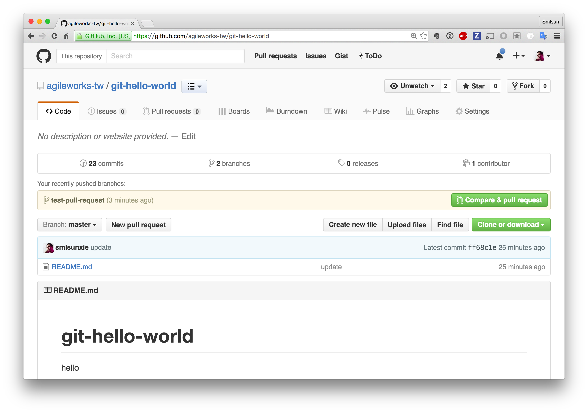
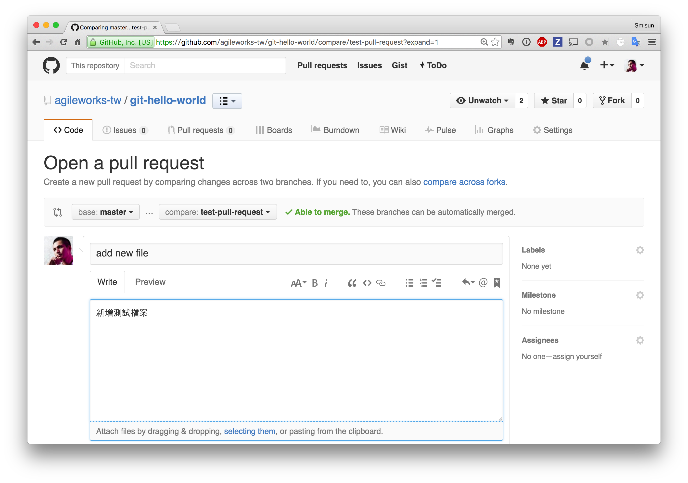
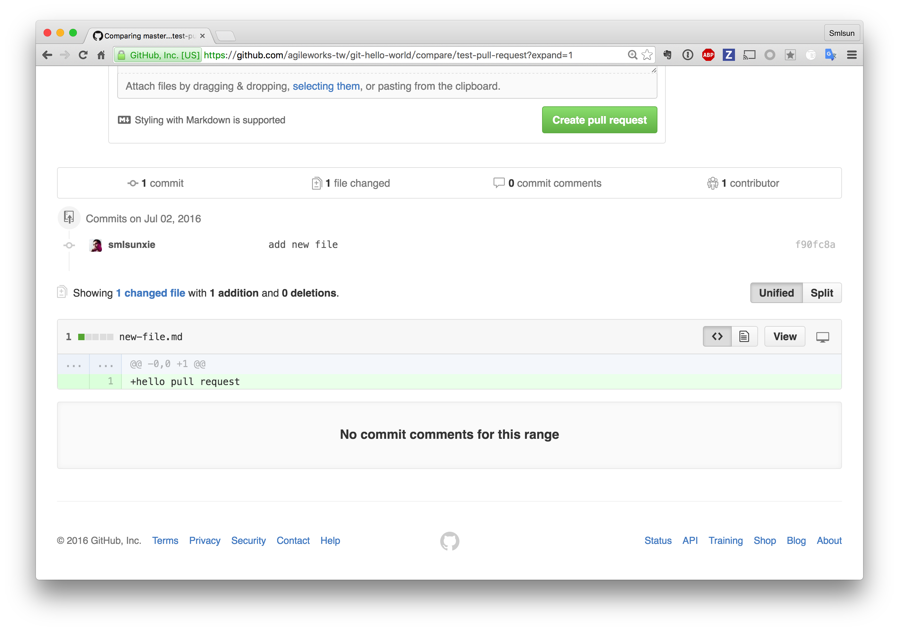
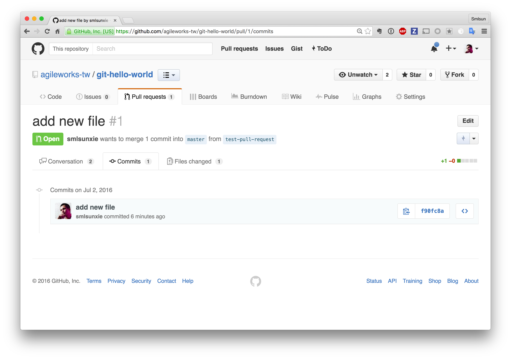
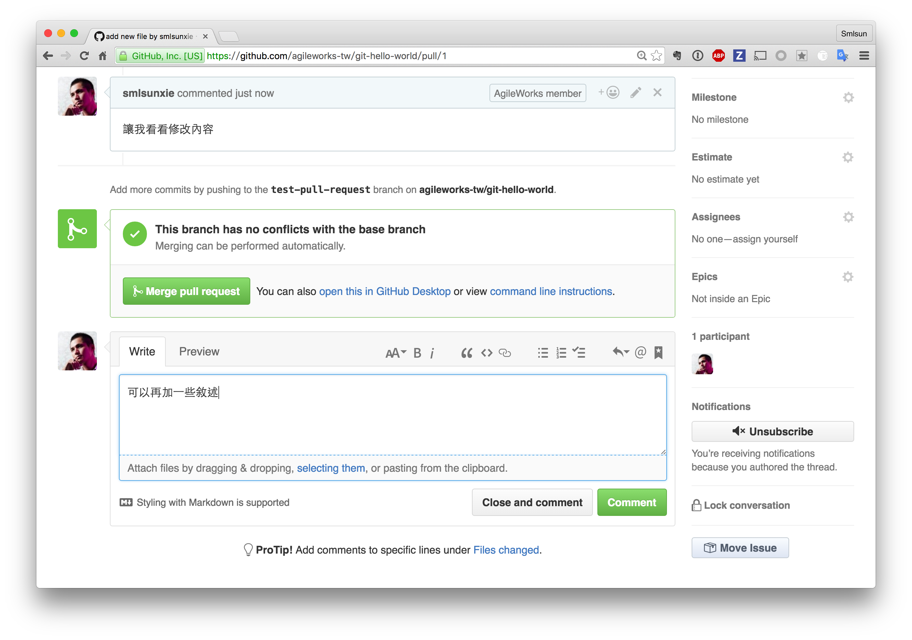
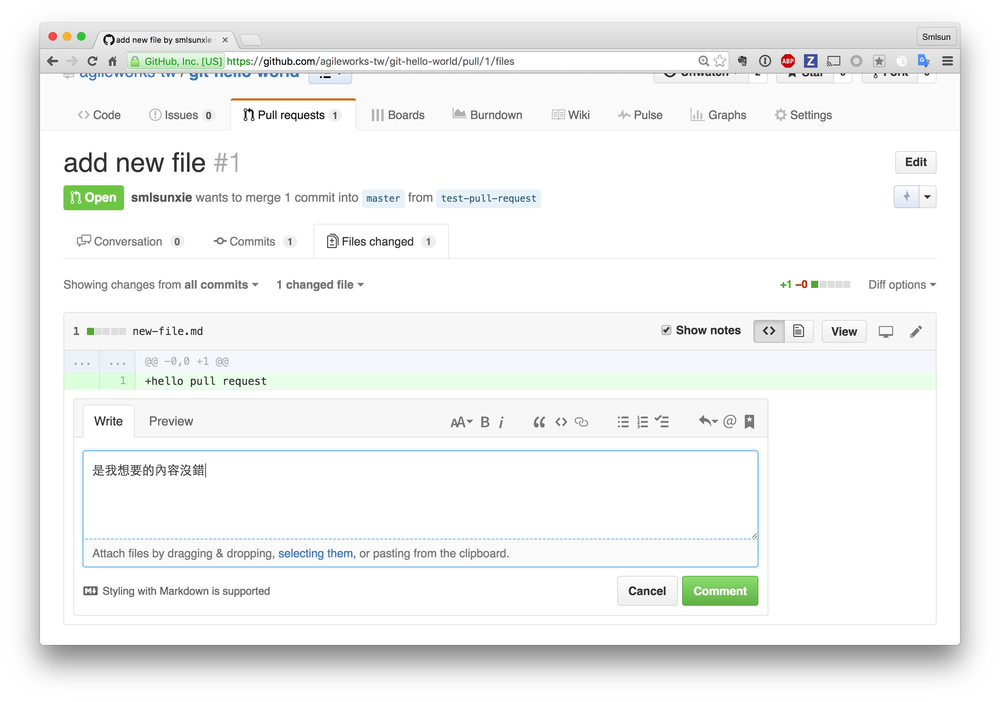
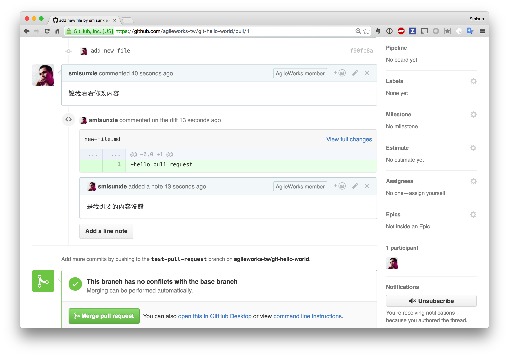
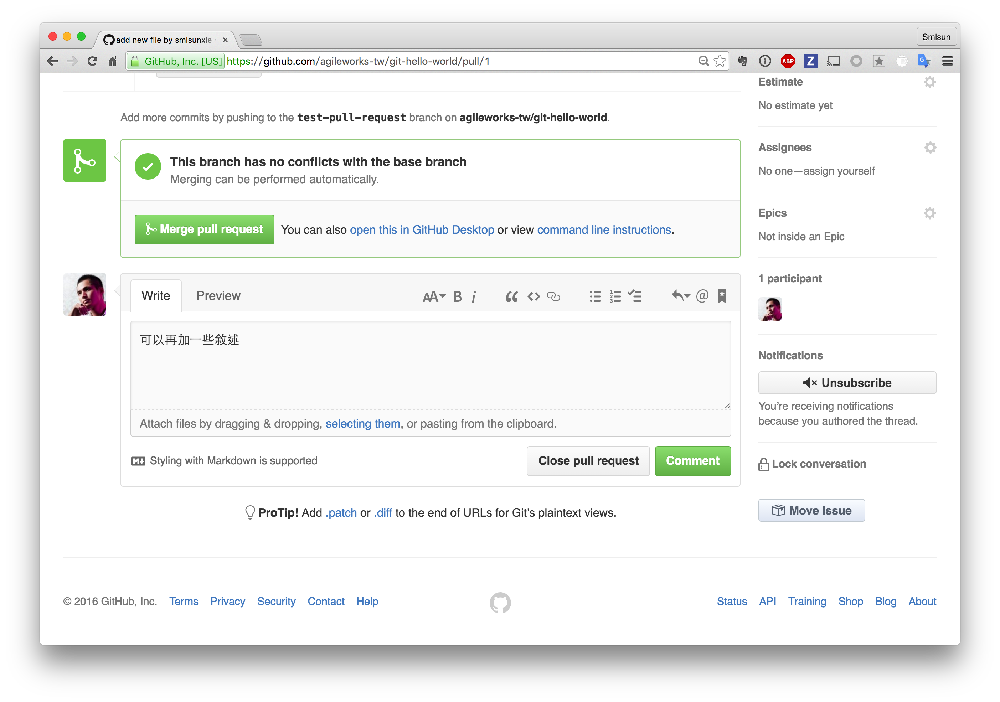
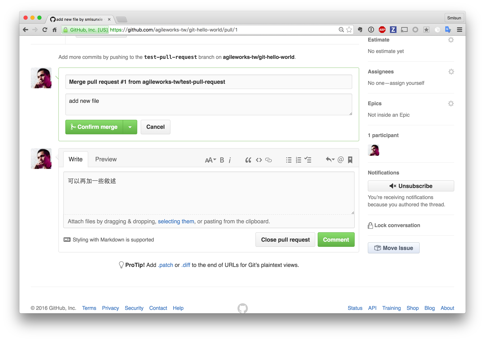
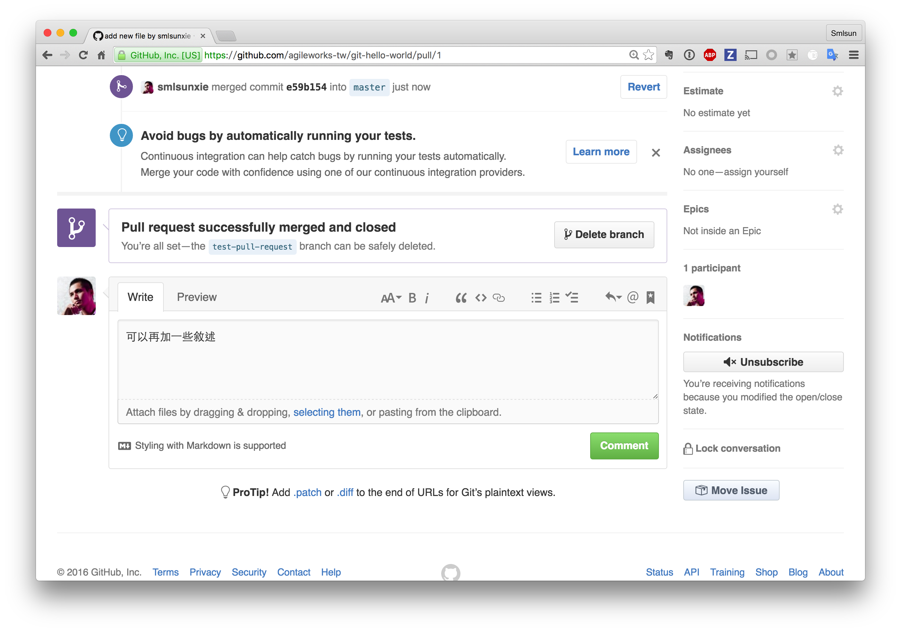

# pull-request

## 操作練習

### 練習前準備

1. `git checkout master`
2. `git checkout -b test-pull-request`
3. 新增檔案：new-file.md
4. 修改檔案：對 new-file.md 進行編輯，新增一行文字 `hello pull request`
5. `git add new-file.md`
6. `git commit -m 'add new file'`
7. `git push -u origin test-pull-request`

上述步驟將完成切換分支，並且假設進行檔案修正，最後將結果推送到新的分之上。

接著我們將把新分之上的修正，合併回 master 透過 pull request 作業來完成

## 偵測是否可建立 pull request

## 建立 pull request

## 檢視 pull request 變更紀錄

## 對 pull request 進行討論

## 接受 pull request

