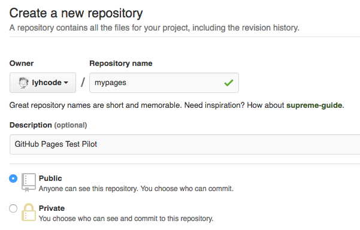
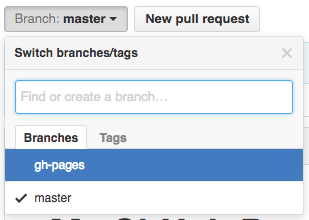
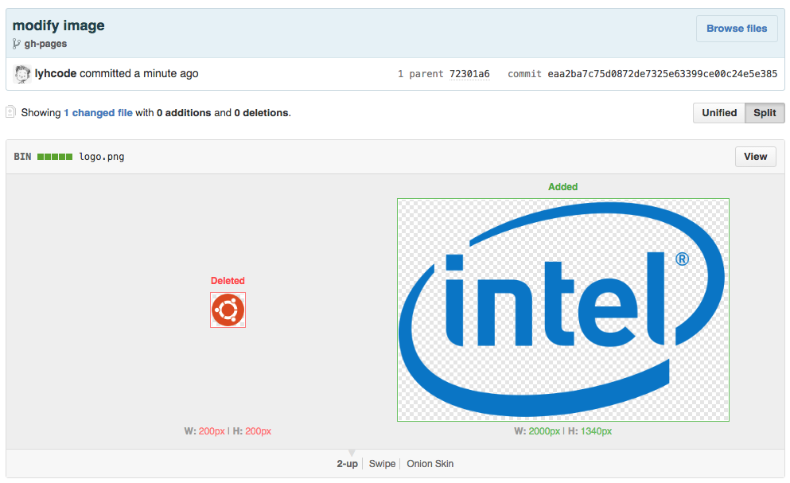

# GitHub Pages

Official Website: https://pages.github.com/

## 建立一個 Repository


## 本地端複製 Repository

```
git clone https://github.com/lyhcode/mypages.git
cd mypages
```

## 編輯說明頁(README)

編輯 `README.md`

使用 Markdown 語法撰寫說明內容

## 提交變更

```
git status
git add README.md
git commit -m 'first commit'
git push
```

## 建立分支

```
git branch gh-pages
git checkout gh-pages
```

也可以加上 `--orphan` 參數。

```
git checkout --orphan gh-pages
```

## 建立網頁內容

新建 `index.html` 檔案，原始碼：

```
<h1>Hello GitHub</h1>
```

提交變更：

```
git status
git commit -m 'add home page'
git push
git push origin gh-pages
```

## 檢視結果



瀏覽網址：

```
http://帳號名稱.github.io/專案名稱/
```

## 修改圖片檔



## Custom Domain Name

https://help.github.com/articles/using-a-custom-domain-with-github-pages/
