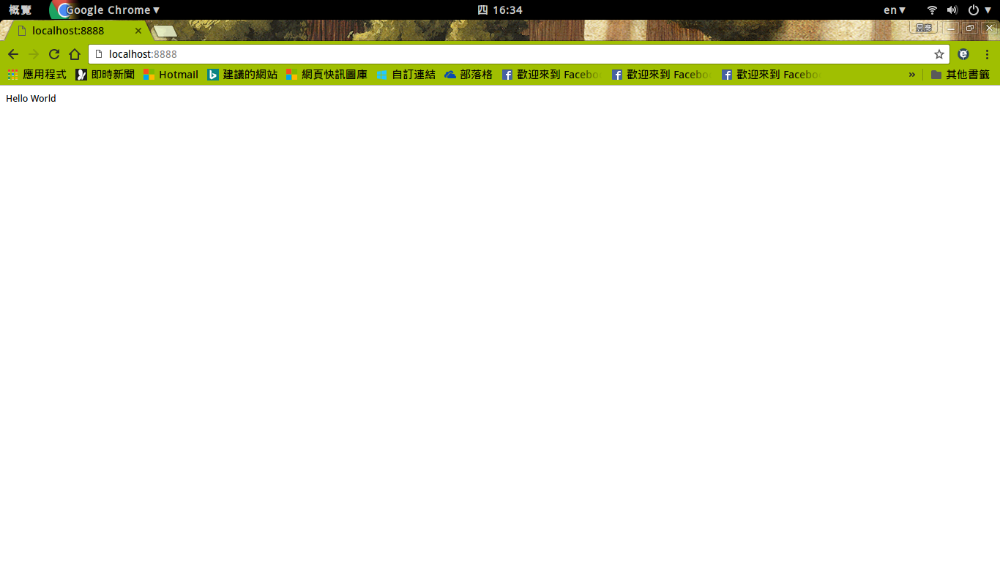

#伺服器是如何處理請求

##難度：
簡易

##目標：
了解伺服器收到請求後的回覆

##專案：
<https://github.com/yanhsu/intern-tutorial/commit/4b7a52b0bbe2a9de42ac08401277a3bb994b39a5>

## 練習：

1.創立一個server.js並輸入程式碼

2.執行 node server.js 指令

3.開啓瀏覽器<http://localhost:8888/>將會看到下圖

